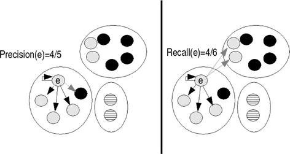
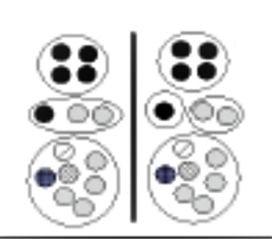

# How to evaluate text clustering algorithms with BCubed?

The B-cubed method is described in detail in:

[1] Bagga, Amit and Breck Baldwin. 1998. Algorithms for scoring coreference chains. In Proceedings of the First International Conference on Language Resources and Evaluation Workshop on Linguistic Coreference.

The examples are taken from this paper:

[2] Amigó, E., Gonzalo, J., Artiles, J. et al. A comparison of extrinsic clustering evaluation metrics based on formal constraints. Inf Retrieval 12, 461–486 (2009). https://doi.org/10.1007/s10791-008-9066-8

In the paper the authors analyzed a wide range of metrics and showed that only BCubed satisfies all formal constraints. However, it is not suitable for overlapping clustering evaluation. 

## How is BCubed Precision and BCubed Recall calculated?

Precision represents how many items in the same cluster belong to its category. 
The Recall associated to one item represents how many items from its category appear in its cluster. [2]



## How to interpret Precision and Recall in BCubed? 

High BCubed __Recall__: Most related items are in a cluster

High BCubed __Precision__: No noisy items in a cluster [2]

## How to easy calculate Precision and Recall?

$$Recall (R) = \frac{\text{number of correct elements in the cluster}^{2}}{\text{number of elements in the cluster}}$$

$$Precision (P) = \frac{\text{number of correct elements in the cluster}^{2}}{\text{number of these elements in all cluster}}$$

$$F(BCubed) = \frac{2 * P * R}{P + R}$$


## Let's calculate the following (left clustered) example [2]



$$Recall (R) = \frac{\frac{4*4}{5} + \frac{1}{5}+ \frac{2*2}{6}+ \frac{3*1}{1}+ \frac{4*4}{6}}{14} = 0.69$$


$$Precision (P) = \frac{\frac{4*4}{4} + \frac{1}{3}+ \frac{2*2}{3}+ \frac{3*1}{7}+ \frac{4*4}{7}}{14} = 0.59 $$

$$F(BCubed) = \frac{2 * 0.69 * 0.59}{0.69 + 0.59} =  = 0.63$$

## How to use BCubed in Python?


```python
%pip install bcubed
```

    Collecting bcubed
      Downloading bcubed-1.5-py2.py3-none-any.whl (8.7 kB)
    Requirement already satisfied: numpy in c:\programdata\anaconda3\envs\global-environment\lib\site-packages (from bcubed) (1.18.0)
    Installing collected packages: bcubed
    Successfully installed bcubed-1.5
    Note: you may need to restart the kernel to use updated packages.
    


```python
import bcubed

"""
   Compute Bcubed Precision, Recall and F-Score 
   clustering_dict: dictionary representing clustering output
   gold_standard_dict: ground-truth dictionary
   Dictionary Format: {item: clusters}
"""

def bcubed_compute(clustering_dict, gold_standard_dict):
    precision = bcubed.precision(clustering_dict, gold_standard_dict)
    recall = bcubed.recall(clustering_dict, gold_standard_dict)
    fscore = bcubed.fscore(precision, recall)
    print("Precision={:.2f}, Recall={:.2f}, F_BCubed={:.2f}".format(precision, recall, fscore))
```


```python
# example ground-truth data
ground_truth = {
    "item1": set(["black", "gray"]),
    "item2": set(["black", "gray"]),
    "item3": set(["blue"]),
    "item4": set(["dashed"]),
}

# example clustering 
clustering = {
    "item1": set(["black"]),
    "item2": set(["gray"]),
    "item3": set(["blue"]),
    "item4": set(["dashed"]),
}

bcubed_compute(clustering, ground_truth)
```

    Precision=1.00, Recall=0.62, F_BCubed=0.77
    

## How to implement BCubed extended version in Python?


```python
import numpy

"""Computes multiplicity Precision for two items."""
def mult_precision(item1, item2, clustering, ground_truth):    
    return min(len(clustering[item1] & clustering[item2]), len(ground_truth[item1] & ground_truth[item2])) \
        / float(len(clustering[item1] & clustering[item2]))

"""Computes the multiplicity Recall for two items."""
def mult_recall(item1, item2, clustering, ground_truth):
    
    return min(len(clustering[item1] & clustering[item2]), len(ground_truth[item1] & ground_truth[item2])) \
        / float(len(ground_truth[item1] & ground_truth[item2]))


"""Computes overall extended BCubed Precision for the Clustering and ground-truth"""
def extended_precision_bcubed(clustering, ground_truth):    
    return numpy.mean([numpy.mean([mult_precision(item1, item2, clustering, ground_truth) \
        for item2 in clustering if clustering[item1] & clustering[item2]]) for item1 in clustering])

"""Computes overall extended BCubed Recall for the Clustering and ground-truth"""
def extended_recall_bcubed(clustering, ground_truth):
    return numpy.mean([numpy.mean([mult_recall(item1, item2, clustering, ground_truth) \
        for item2 in clustering if ground_truth[item1] & ground_truth[item2]]) for item1 in clustering])
```


```python
print("Extended Precision={:.2f}, Extended Recall={:.2f}".format(extended_precision_bcubed(clustering, ground_truth), extended_recall_bcubed(clustering, ground_truth)))
```

    Extended Precision=1.00, Extended Recall=0.62
    

## How to calculate BCubed extended? --> see B-Cubed_Extended_Calculationc.pdf

Source:

http://e-spacio.uned.es/fez/eserv/bibliuned:DptoLSI-ETSI-MA2VICMR-1090/Documento.pdf

http://www.cs.cmu.edu/~yimengz/papers/Coreference_survey.pdf

https://www.uni-weimar.de/medien/webis/events/pan-16/pan16-papers-final/pan16-author-identification/sari16-notebook.pdf 

The python implementation is based on: https://github.com/hhromic/python-bcubed


```python

```
